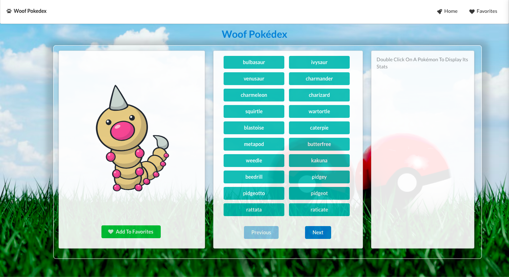
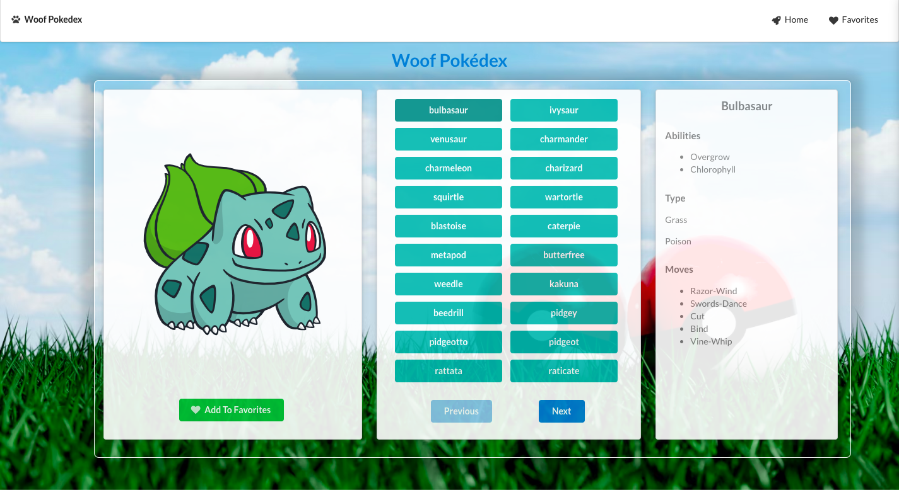
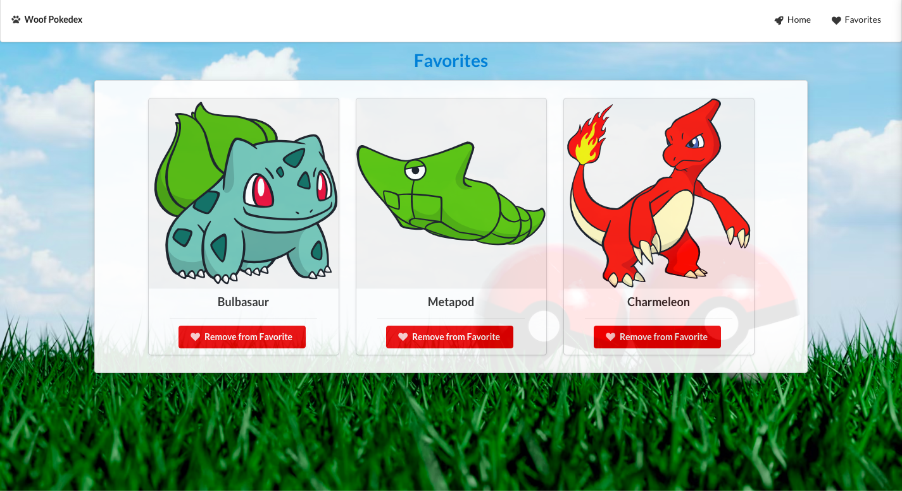

# :rocket: Woof Pokédex (BETA)

Dulce the Chihuahua :dog: reimagines a Poxédex to see all of the OG pokémons. 

## Screenshots





## 🔨 Tools
- React
- React-DOM
- Vite
- Redux Toolkit
- Semantic UI
- Axios
- React-router


## ✨ Live Demo

You can look at it [here](https://woof-pokedex.netlify.app/).


## 💻 Local

To run locally, run ```npm run dev```


## Author

👤 Elizabeth Villalejos

- [Github](https://github.com/misselliev)
- [Linkedin](https://linkedin.com/elivillalejos)
- [Dev.to](https://dev.to/misselliev)
- [Email](mailto:elizabeth.villalejos@gmail.com?subject=Website%20Inquiry)


## 🤝 Contributing

Contributions, issues and feature requests are welcome!

Feel free to check the [issues page](issues/).

## Show your support

Give a ⭐️ if you like this project!

> “What simple action could you take today to produce a new momentum toward success in your life?” Tony Robbins
